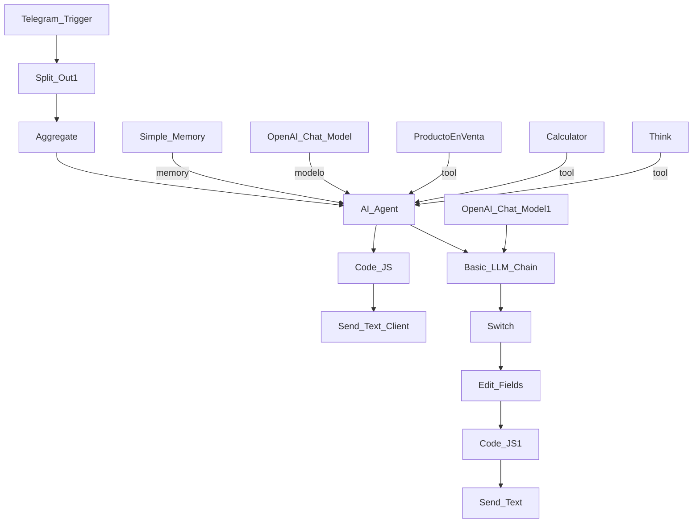

# n8n-telegram-food-assistant

Asistente inteligente para atención al cliente y gestión de pedidos en cafeterías, integrado con Telegram y potenciado por IA.

## Descripción

Este flujo de trabajo automatiza la atención al cliente de la cafetería **SaboreaYa**, permitiendo recibir pedidos, responder consultas, validar disponibilidad de productos y gestionar el método de pago, todo a través de Telegram. Utiliza inteligencia artificial para interpretar mensajes, mantener el contexto de conversación y generar respuestas personalizadas.

---

##  Componentes principales

- **Telegram Trigger**: Captura mensajes entrantes de clientes.
- **AI Agent (LangChain)**: Interpreta la intención del cliente y responde con empatía y precisión.
- **Memory Buffer**: Mantiene el contexto de conversación por cliente.
- **Google Sheets Tool**: Consulta productos disponibles en tiempo real.
- **Calculator Tool**: Realiza cálculos de precios y facturación.
- **Think Tool**: Mejora la lógica de decisión del agente.
- **OpenAI Chat Model**: Potencia el razonamiento y generación de texto.
- **Code Nodes**: Escapan caracteres Markdown, interpretan pagos y generan mensajes personalizados.
- **Switch & Set Nodes**: Clasifican el tipo de pago y preparan la respuesta final.
- **Telegram Output**: Envía mensajes al cliente, incluyendo confirmaciones y opciones de aprobación.

##  Funcionalidades destacadas
 - Atención personalizada con memoria por cliente.
 - Validación automática de productos disponibles.
 - Generación de factura y confirmación de orden.
 - Clasificación inteligente del método de pago.
 - Mensajes enriquecidos con MarkdownV2.

## Escalabilidad
 - Este flujo puede extenderse fácilmente para:
 - Integrar pagos reales.
 - Registrar órdenes en bases de datos.
 - Enviar notificaciones por correo o WhatsApp.
 - Conectarse con sistemas de logística o delivery.

##  Flujo general

### Requisitos
 - Cuenta activa en Telegram con bot configurado.
 - Acceso a Google Sheets con productos disponibles.
 - Credenciales de OpenAI configuradas en n8n.
 - n8n versión 1.0 o superior.

#### Cómo desplegar
1. Clona o importa el flujo en tu instancia de n8n.
2. Configura las credenciales necesarias:
 - Telegram API
 - Google Sheets OAuth2
 - OpenAI API Key
3. Personaliza el systemMessage del agente si deseas adaptar el tono o comportamiento.
4. Activa el webhook de Telegram y prueba enviando un mensaje.

🧾 Licencia
Este flujo es propiedad de SaboreaYa. Puede ser adaptado para otros negocios de alimentos bajo autorización.
